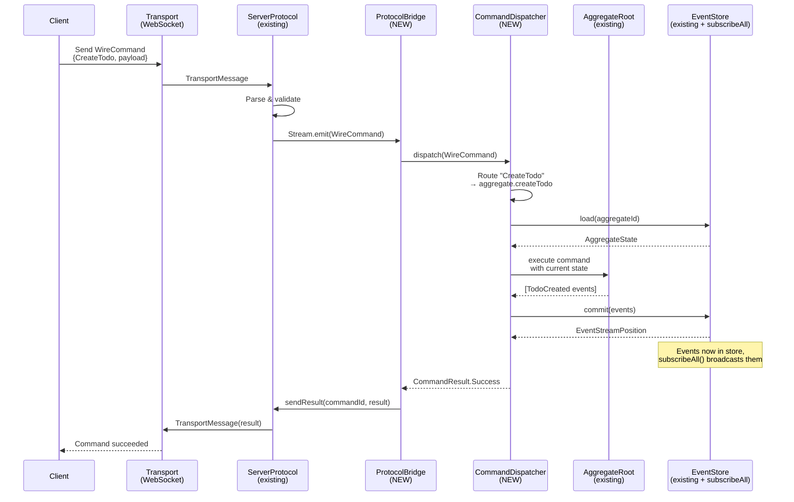
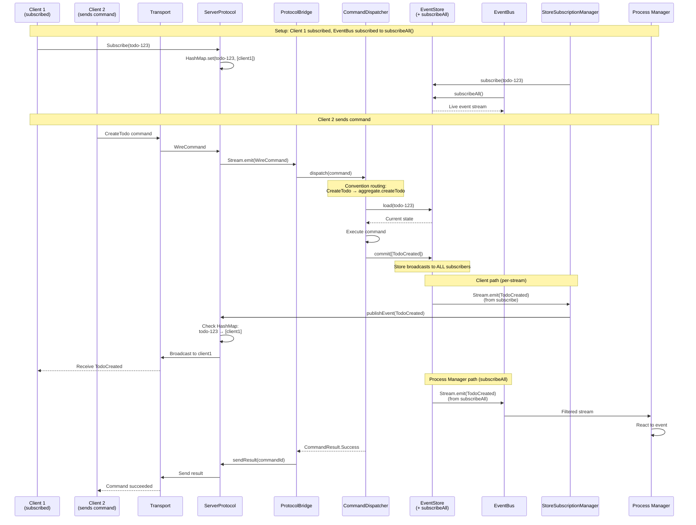
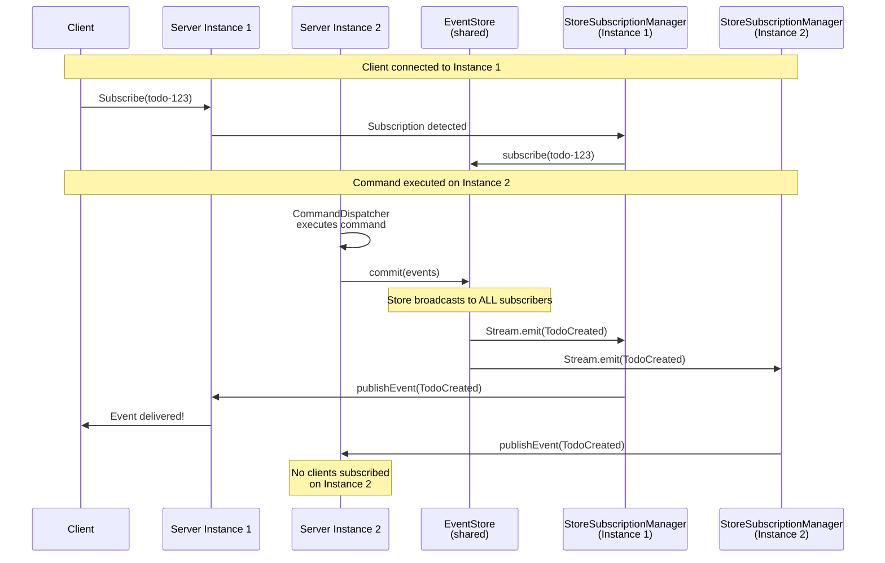
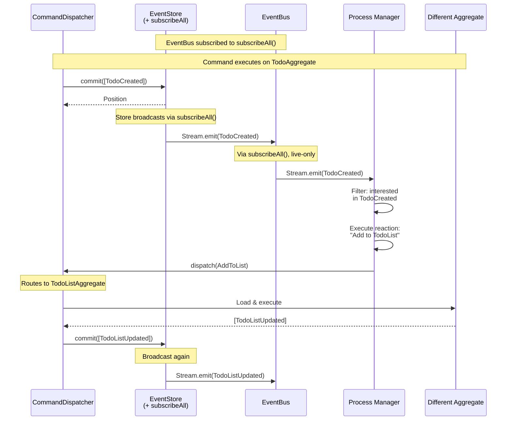
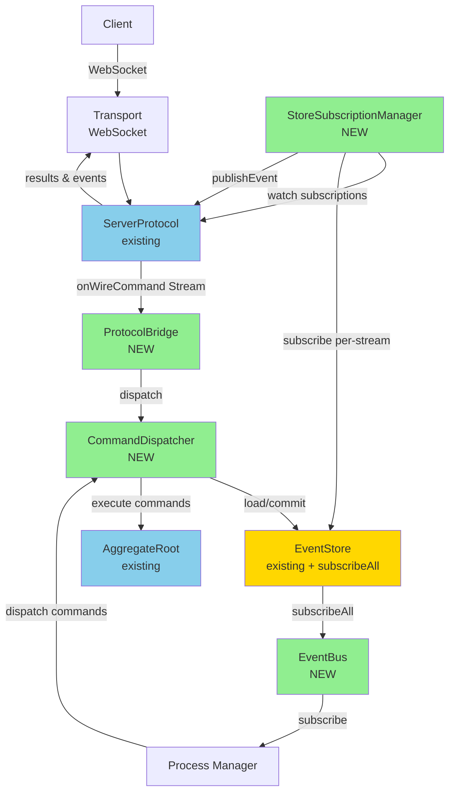

# Event Sourcing Server - Component Interaction Sequences

## Command Execution Flow

## Client Subscription & Event Delivery Flow

```mermaid
sequenceDiagram
    participant Client
    participant Transport as Transport<br/>(WebSocket)
    participant Protocol as ServerProtocol<br/>(existing)
    participant SubMgr as StoreSubscriptionManager<br/>(NEW)
    participant Store as EventStore<br/>(existing)

    Note over Client,Store: Client subscribes to stream

    Client->>Transport: Subscribe(streamId: "todo-123")
    Transport->>Protocol: TransportMessage(subscribe)
    Protocol->>Protocol: Add to subscriptions<br/>HashMap.set(todo-123, [clientId])

    SubMgr->>Protocol: Watch subscription state
    SubMgr->>SubMgr: Detect new subscription<br/>for "todo-123"
    SubMgr->>Store: subscribe(streamId: "todo-123")
    Store-->>SubMgr: Stream<Events>

    Note over SubMgr,Store: Events committed by ANY server instance

    Store->>SubMgr: Stream.emit(TodoCreated)
    SubMgr->>Protocol: publishEvent(TodoCreated)
    Protocol->>Protocol: Check subscriptions<br/>HashMap.get(todo-123)
    Protocol->>Transport: broadcast to subscribed clients
    Transport-->>Client: Receive TodoCreated event

    Note over Client,Store: Client unsubscribes

    Client->>Transport: Unsubscribe
    Transport->>Protocol: Remove from subscriptions
    Protocol->>Protocol: HashMap.remove(clientId)

    SubMgr->>Protocol: Watch subscription state
    SubMgr->>SubMgr: Detect last client gone
    SubMgr->>Store: Interrupt subscription
```

## Complete End-to-End Flow (Command → Event Delivery)

## Multi-Instance Event Delivery

## Process Manager Reaction Flow

## Component Dependencies Visualization

## Key Insights

### Two Event Paths from EventStore

1. **Process Manager path (via subscribeAll):**
   - EventStore.subscribeAll() → EventBus → Process Managers
   - Live-only (no historical replay)
   - Best-effort delivery
   - Works across multiple server instances
   - Filtered by event type

2. **Client path (via per-stream subscribe):**
   - EventStore.subscribe(streamId) → StoreSubscriptionManager → ServerProtocol → Clients
   - Historical + live events
   - Filtered by client subscription
   - Works across server instances

**Critical:** CommandDispatcher NEVER publishes to EventBus. Events flow: EventStore → EventBus (via subscribeAll).

### Critical Design Points

1. **EventStore.subscribeAll() is required**
   - New method added to EventStore interface (hp-8)
   - Live-only, no global event number
   - All EventStore implementations must support it
   - EventBus uses this exclusively

2. **No double events**
   - CommandDispatcher: commits to EventStore only
   - EventBus: receives from EventStore.subscribeAll() only
   - Single path = no duplication

3. **StoreSubscriptionManager watches ServerProtocol state**
   - Creates/destroys per-stream subscriptions dynamically
   - Based on active client subscriptions
   - Reference counting (last client unsubscribe → cleanup)

4. **ProtocolBridge is just wiring**
   - Pure function, not a service
   - Commands in, results out
   - No event handling (that's StoreSubscriptionManager)

5. **CommandDispatcher is simple**
   - Routes commands
   - Commits to store
   - Returns results
   - Does NOT publish anywhere

6. **Multi-instance support**
   - Both event paths work across server instances
   - Process managers see events from any instance
   - Clients receive events regardless of which instance committed them
