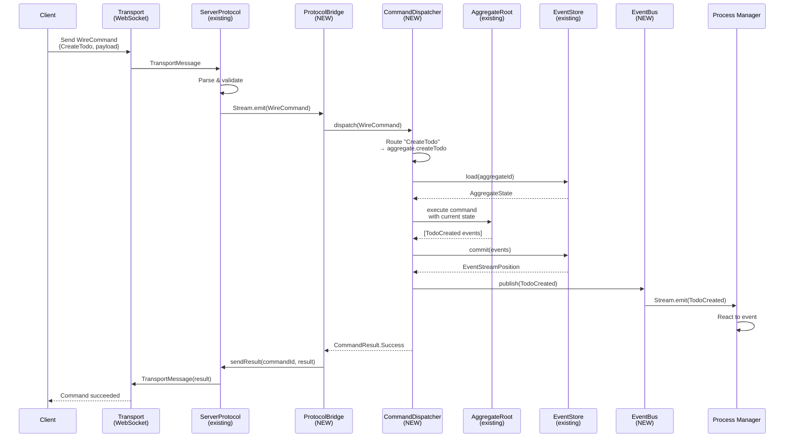
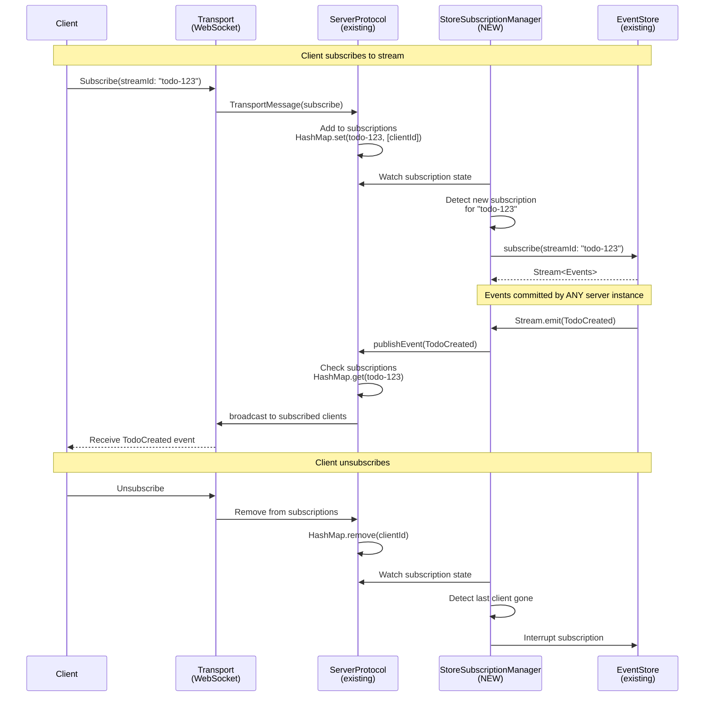
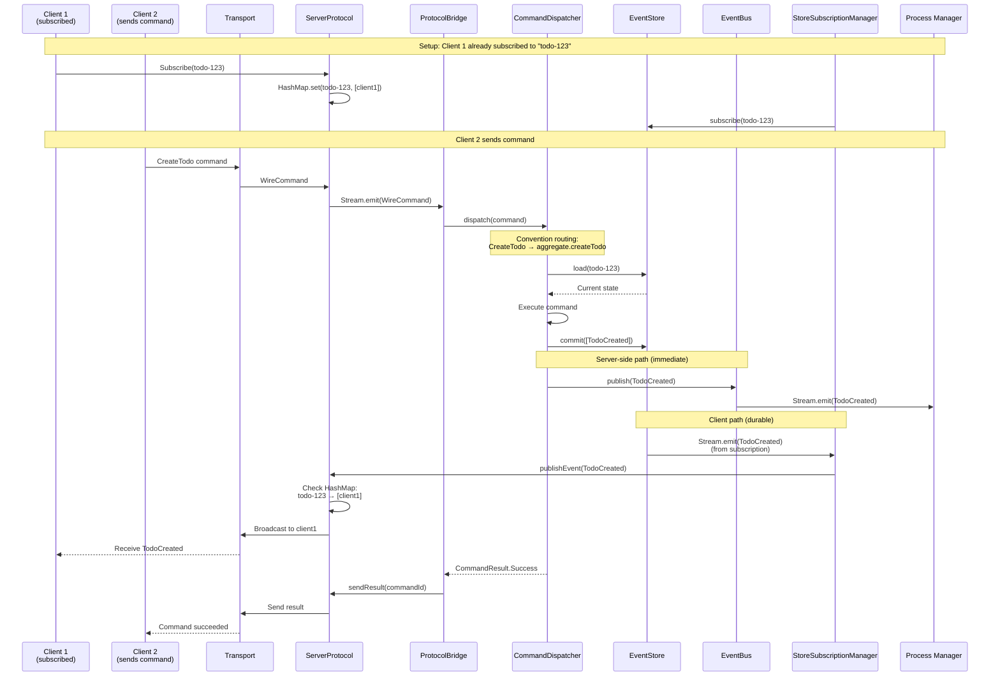
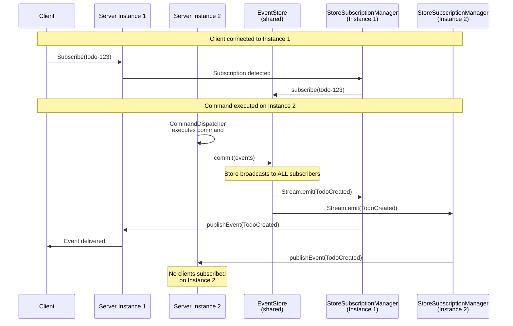
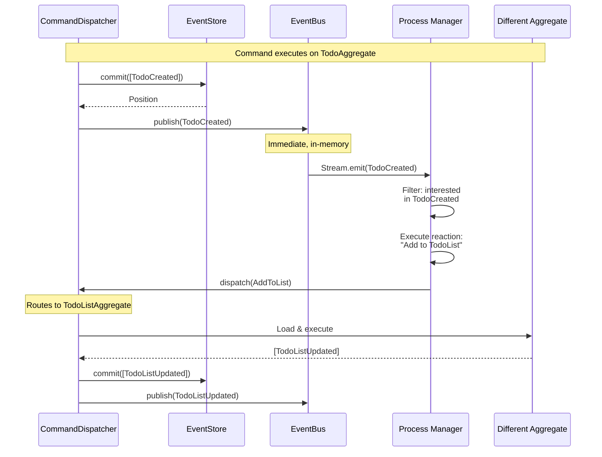
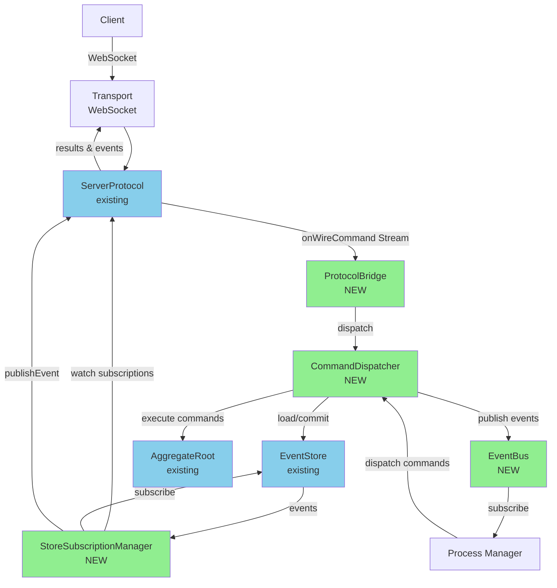

# Event Sourcing Server - Component Interaction Sequences

## Command Execution Flow

## Client Subscription & Event Delivery Flow

## Complete End-to-End Flow (Command → Event Delivery)

## Multi-Instance Event Delivery

## Process Manager Reaction Flow

## Component Dependencies Visualization

## Key Insights

### Two Event Paths

1. **Server-side (EventBus):**
   - CommandDispatcher → EventBus → Process Managers
   - Immediate, in-memory
   - No historical replay
   - Single server instance only

2. **Client-side (StoreSubscriptionManager):**
   - EventStore → StoreSubscriptionManager → ServerProtocol → Clients
   - Durable, multi-instance
   - Historical + live events
   - Works across server instances

### Critical Design Points

1. **StoreSubscriptionManager watches ServerProtocol state**
   - Creates/destroys EventStore subscriptions dynamically
   - Based on active client subscriptions
   - Reference counting (last client unsubscribe → cleanup)

2. **ProtocolBridge is just wiring**
   - Pure function, not a service
   - Commands in, results out
   - No event handling (that's StoreSubscriptionManager)

3. **CommandDispatcher is the orchestrator**
   - Routes commands
   - Commits to store
   - Publishes to bus
   - Returns results

4. **EventBus is server-internal only**
   - Process managers
   - Projections
   - NOT for client delivery
